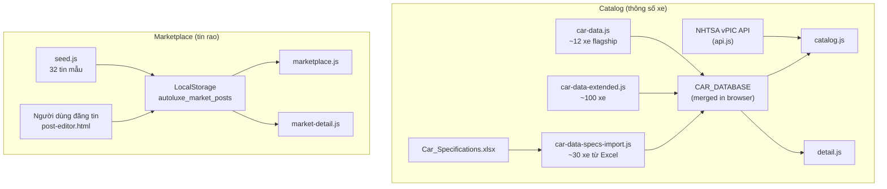

# Nguồn dữ liệu Catalog & Marketplace — AutoLuxe (cho AI)

Tài liệu này mô tả **toàn bộ nguồn dữ liệu** mà chatbot / AI assistant có thể dùng để tư vấn xe catalog và tin rao marketplace.

---

## Tổng quan kiến trúc dữ liệu



---

## 1. Catalog — Dữ liệu xe

### 1.1 Mục đích
- Hiển thị danh sách hãng/model trên `/pages/catalog.html`
- Trang chi tiết `/pages/car-detail.html?id=<car-id>`
- So sánh xe, wishlist, quickview

### 1.2 Nguồn dữ liệu

| Lớp | File | Vai trò |
|-----|------|---------|
| **API ngoài** | `assets/js/api.js` | Lấy danh sách **Make** và **Model** từ [NHTSA vPIC](https://vpic.nhtsa.dot.gov/api/) (miễn phí) |
| **Core DB** | `assets/js/car-data.js` | `CAR_DATABASE` — xe flagship có ảnh, mô tả, thông số đầy đủ |
| **Extended** | `assets/js/car-data-extended.js` | `CAR_DATABASE_EXTENDED` — merge vào `CAR_DATABASE` |
| **Excel import** | `assets/js/car-data-specs-import.js` | Sinh từ `assets/Car_Specifications.xlsx` qua `node tools/import-car-specs.js` |
| **Logic UI** | `assets/js/catalog.js` | Ghép NHTSA models + local specs/ảnh; lọc, sort, phân trang |

### 1.3 Schema một xe trong `CAR_DATABASE`

```javascript
{
  id: 'ferrari-sf90-stradale',      // slug, dùng trong URL
  make: 'Ferrari',
  model: 'SF90 Stradale',
  aliases: ['SF90', 'SF90 Spider'], // optional — khớp tên thay thế
  year: 2024,
  horsepower: 986,
  topSpeed: '340 km/h',
  zeroToHundred: '2.5s',
  engine: 'V8 Twin-Turbo Hybrid',
  drivetrain: 'AWD',
  torque: '800 Nm',
  weight: '1,570 kg',
  transmission: '8-speed DCT',
  seats: 2,
  doors: 2,
  dimensions: '4,710 x 1,972 x 1,186 mm',
  fuelType: 'Petrol / Plug-in Hybrid',
  bodyType: 'Coupe',
  priceUSD: 625000,                 // giá MSRP tham khảo, không phải giá rao
  brakes: 'Carbon-ceramic',
  shortDescription: '...',
  longDescription: '...',
  heroImage: '../assets/images/cars/...',
  gallery: ['...']
}
```

### 1.4 Helper functions (`car-data.js`)

| Hàm | Mô tả |
|-----|--------|
| `getCarById(id)` | Lấy xe theo slug |
| `getCarByMakeModel(make, model)` | Khớp hãng + model (có aliases) |
| `getCarsByMake(make)` | Tất cả xe một hãng |
| `getAllCarSummaries()` | Danh sách rút gọn |
| `getRelatedCars(car, maxCount)` | Xe cùng hãng |

### 1.5 API NHTSA (catalog.js gọi)

| Endpoint | Dùng cho |
|----------|----------|
| `GET /vehicles/GetAllMakes?format=json` | Dropdown hãng |
| `GET /vehicles/GetModelsForMake/{make}?format=json` | Model theo hãng |

**Lưu ý cho AI:** NHTSA chỉ cung cấp **tên hãng/model**, không có hp, giá, ảnh. Thông số chi tiết chỉ có khi xe tồn tại trong `CAR_DATABASE`.

### 1.6 Ảnh xe
- Thư mục: `assets/images/cars/` (theo hãng: `ferrari/`, `lamborghini/`, …)
- Placeholder: `assets/images/cars/placeholder.svg`
- Resolver: `CarImagePaths.resolveImage()` trong `car-data.js`

---

## 2. Marketplace — Tin rao bán xe

### 2.1 Mục đích
- Danh sách tin: `/pages/marketplace.html`
- Chi tiết tin: `/pages/market-detail.html?id=<post-id>`
- Đăng/sửa: `/pages/post-editor.html`
- Checkout mô phỏng: `/pages/checkout.html?postId=<post-id>`

### 2.2 Nguồn dữ liệu

| Lớp | File / Key | Vai trò |
|-----|------------|---------|
| **Seed mẫu** | `assets/js/seed.js` | 32 tin demo, tự merge khi `autoluxe_seed_version` tăng |
| **Runtime** | LocalStorage `autoluxe_market_posts` | Toàn bộ tin (seed + user) |
| **Logic** | `assets/js/marketplace.js` | CRUD, lọc, sort, moderation |
| **Chi tiết** | `assets/js/market-detail.js` | Render + đánh giá showroom |

### 2.3 Schema một tin rao

```javascript
{
  id: 'seed_001',                    // hoặc post_<timestamp>_
  ownerEmail: 'demo_ferrari@autoluxe.vn',
  ownerName: 'SupercarLover',
  title: 'Ferrari 488 GTB 2019 - Full Option',
  brand: 'Ferrari',
  model: '488 GTB',
  year: 2019,
  price: 280000,                     // USD
  mileage: 12000,                    // km
  fuel: 'Xăng',                      // Xăng | Dầu | Hybrid | Điện
  transmission: 'Tự động',           // Tự động | Số sàn | PDK | DCT
  location: 'TP. Hồ Chí Minh',
  image: '../assets/images/cars/...', // ảnh cover
  images: [],                        // optional — gallery data URLs
  description: '...',
  moderation: 'approved',            // approved | pending_approval | rejected
  moderationReason: '',
  availability: 'available',           // available | pending_payment | sold
  status: 'available',                 // alias của availability
  createdAt: '2025-04-10T08:00:00.000Z',
  updatedAt: '...'                     // khi sửa
}
```

### 2.4 Trạng thái hiển thị công khai

Tin chỉ hiện trên marketplace khi:
- `moderation === 'approved'`
- `availability` / `status === 'available'`

Tin user mới đăng mặc định `moderation: 'pending_approval'` — cần admin duyệt (`pages/admin.html`).

### 2.5 Liên kết Catalog ↔ Marketplace

`catalog.js` gọi `Marketplace.getAvailableListingCountByBrandModel(brand, model)` để hiển thị badge "có tin rao" trên thẻ catalog.

---

## 3. Export dữ liệu cho AI training

### 3.1 Chạy script export

```bash
node tools/export-ai-training-data.js
```

**Output:**

| File | Nội dung |
|------|----------|
| `docs/ai-training/catalog-cars.json` | Toàn bộ `CAR_DATABASE` dạng JSON chuẩn hóa |
| `docs/ai-training/marketplace-listings.json` | 32 tin seed dạng JSON |
| `docs/ai-training/autoluxe-combined-training.md` | Markdown upload Chatbase / RAG |

### 3.2 File training có sẵn

| File | Mô tả |
|------|--------|
| `chatbase-training-source.md` | FAQ + policy bot (không có raw data từng xe) |
| `docs/autoluxe-ai-training.md` | **File tổng hợp** — persona + catalog + marketplace (upload chính) |
| `docs/ai-training/marketplace-ai-training.md` | **Marketplace only** — tính năng, FAQ, thống kê, 30 tin (upload riêng hoặc bổ sung) |
| `docs/ai-training/marketplace-listings.json` | Tin rao dạng JSON |

### 3.3 Gợi ý tích hợp Chatbase / RAG

1. Upload `autoluxe-combined-training.md` làm **Knowledge Base**
2. Giữ `chatbase-training-source.md` cho **persona + FAQ + policy**
3. Refresh sau mỗi lần thêm xe (`car-data*.js`) hoặc tin seed (`seed.js`):
   ```bash
   node tools/export-ai-training-data.js
   ```

### 3.4 Câu hỏi AI nên trả lời khác nhau

| Loại câu hỏi | Nguồn trả lời |
|--------------|---------------|
| "SF90 có bao nhiêu mã lực?" | `CAR_DATABASE` / `catalog-cars.json` |
| "Có ai bán Huracán EVO không?" | `marketplace-listings.json` hoặc hướng dẫn mở Marketplace |
| "Giá SF90 trên marketplace?" | Tin cụ thể trong seed — **không** dùng `priceUSD` catalog |
| "Danh sách model Ferrari?" | NHTSA API + catalog |

**Quan trọng:** Dữ liệu marketplace runtime (LocalStorage) **khác nhau theo trình duyệt**. Bot nên nói rõ khi không có realtime.

---

## 4. LocalStorage keys liên quan

| Key | Module | Mô tả |
|-----|--------|--------|
| `autoluxe_market_posts` | marketplace.js | Tất cả tin rao |
| `autoluxe_seed_version` | seed.js | Version seed (hiện tại: **2**) |
| `autoluxe_users` | auth.js | Tài khoản |
| `autoluxe_session` | auth.js | Phiên đăng nhập |

---

## 5. Cách refresh tin marketplace mẫu

Nếu đã vào site trước đó với seed v1 (8 tin):

1. Mở bất kỳ trang marketplace (`marketplace.html`, `market-detail.html`, …)
2. `Seed.run()` tự chạy — merge thêm tin `seed_009` → `seed_032` nếu chưa có
3. Hoặc xóa key `autoluxe_seed_version` trong DevTools → Application → Local Storage → reload

Để reset hoàn toàn tin mẫu: xóa `autoluxe_market_posts` và `autoluxe_seed_version`, reload trang.

---

## 6. Thương hiệu được hỗ trợ

Ferrari, Lamborghini, McLaren, Porsche, Bugatti, Koenigsegg, Aston Martin (+ các hãng khác qua NHTSA nếu có model trong DB).
